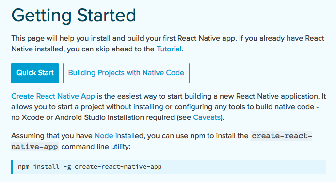

+ 時間は20分
+ 可能ならexpo使ってスマホからgithub表示
+ まとめ
  + 今から新規で実装するならexpo使ってもいいんじゃない？
  + リスク回避より、問題になったら作り直す方がコスト低い
+ XDEの紹介
  + expコマンドでもいける
+ standalone app以外にリリースするには？
  + ejectすればいける
+ publishするとどうなる？
+ カメラやスマホの情報へのアクセス方法
+ GitPitch利用

# React Native into Expo.

## Install Expo.

Please download Expo app.

https://expo.io/tools

## What's React Native?



## What's create-react-native-app?

```sh
$ npm install -g create-react-native-app
$ create-react-native-app AwesomeProject
$ cd AwesomeProject
$ npm start
```

Start a development server.
Using the Expo app, Scan the QR code.
Edit this app, The application is live reloading.

**Develop at virtual mashine**
```sh
$ REACT_NATIVE_PACKAGER_HOSTNAME='my-custom-ip-address-or-hostname' npm start
```

### Philosophy

+ Minimal "Time to Hello World"
    + Create React Native App should reduce the setup time it takes to try building a mobile app to the absolute minimum, ideally on par with React web development (especially as seen with Create React App).
+ Develop on Your Device
  + It should be easy to develop on a physical device when you want to test how your app feels and responds to inputs.
+ One Build Tool
  + If you just want to get started with React Native, you shouldn't need to install Xcode, Android Studio, NDKs, or mess with environment variables.
+ No Lock-In
  + You can always "eject" to your own build setup if you need to write custom native code or modify how your app is built.

  ## What's Expo?
