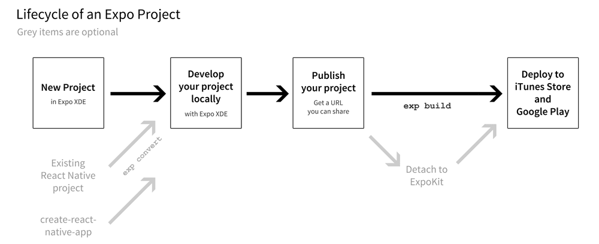
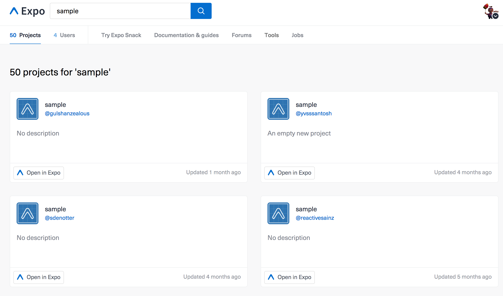

+ 時間は20分
+ 可能ならexpo使ってスマホからgithub表示
+ まとめ
  + 今から新規で実装するならexpo使ってもいいんじゃない？
  + リスク回避より、問題になったら作り直す方がコスト低い
+ カメラやスマホの情報へのアクセス方法

# React Native into Expo.

# @besutome


### Freelance
### Frontend developer

Host an React Native Meetup.

## Install Expo.

Please download Expo app.

https://expo.io/tools

## What's React Native?

**Learn once, write anywhere: Build mobile apps with React**


## What's create-react-native-app?
### Philosophy

+ Minimal "Time to Hello World"
    + Create React Native App should reduce the setup time it takes to try building a mobile app to the absolute minimum, ideally on par with React web development (especially as seen with Create React App).
+ Develop on Your Device
  + It should be easy to develop on a physical device when you want to test how your app feels and responds to inputs.
+ One Build Tool
  + If you just want to get started with React Native, you shouldn't need to install Xcode, Android Studio, NDKs, or mess with environment variables.
+ No Lock-In
  + You can always "eject" to your own build setup if you need to write custom native code or modify how your app is built.

```sh
$ npm install -g create-react-native-app
$ create-react-native-app AwesomeProject
$ cd AwesomeProject
$ npm start
```

Start a development server.
Using the Expo app, Scan the QR code.
Edit this app, The application is live reloading.

**Develop at virtual mashine**
```sh
$ REACT_NATIVE_PACKAGER_HOSTNAME='my-custom-ip-address-or-hostname' npm start
```

## What's Expo?
**Easily build apps with React Native**  
https://expo.io/

### Project Lifecycle



+ Creating an Expo Project
  + create-react-app
  + New project in Expo XDE
  + `$ exp convert`
+ Developing Locally
+ Publishing your Project
  + `$ exp publish`
  + Use Expo XDE
+ Updating your App
+ Deploying to the Apple App Store and Google Play
  + Building Standalone Apps
+ Changing Native Code
  + Detach to ExpoKit

### Expo XDE

XDE is GUI tools.
CLI is `exp`.

+ Share
+ Opening on a device
+ Development mode
+ Project dialog (with project open)
+ Publish

https://docs.expo.io/versions/v18.0.0/introduction/xde-tour.html

### Publishing to Expo
```sh
$ npm i -g exp
$ exp publish
```



### Building standalone app

Use to standalone builds.
Deploying to Apple's App Store or Google's Play Store.

https://docs.expo.io/versions/v18.0.0/guides/building-standalone-apps.html

### Ejecting from Create React Native App

**Caution: Do not use Expo.**  
https://github.com/react-community/create-react-native-app/blob/master/EJECTING.md

`$ npm run eject`

## Use Native

### Permissions
+ `Expo.Permissions.getAsync(type)`
  Access to the provided permission type.

```js
async function alertIfRemoteNotificationsDisabledAsync() {
  const { Permissions } = Expo;
  const { status } = await Permissions.getAsync(Permissions.REMOTE_NOTIFICATIONS);
  if (status !== 'granted') {
    alert('Hey! You might want to enable notifications for my app, they are good.');
  }
}
```

+ `Expo.Permissions.askAsync(type)`
  + Prompt the user for a permission.
```js
async function getLocationAsync() {
  const { Location, Permissions } = Expo;
  const { status } = await Permissions.askAsync(Permissions.LOCATION);
  if (status === 'granted') {
    return Location.getCurrentPositionAsync({enableHighAccuracy: true});
  } else {
    throw new Error('Location permission not granted');
  }
}
```

+ `Expo.Permissions.REMOTE_NOTIFICATIONS`
+ `Expo.Permissions.LOCATION`
+ `Expo.Permissions.CAMERA`
+ `Expo.Permissions.AUDIO_RECORDING`
+ `Expo.Permissions.CONTACTS`
  + phoneNumbers
  + emails
  + addresses
  + image (iOS only)
  + thumbnail
  + etc...
